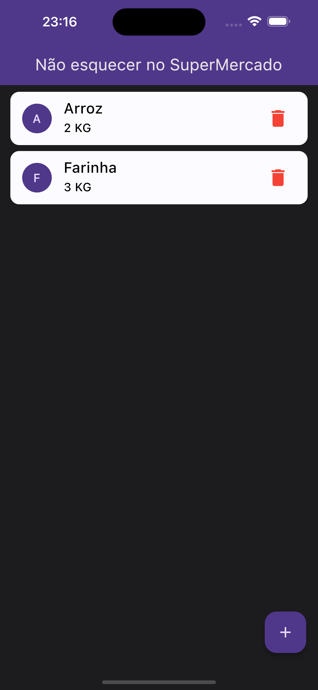
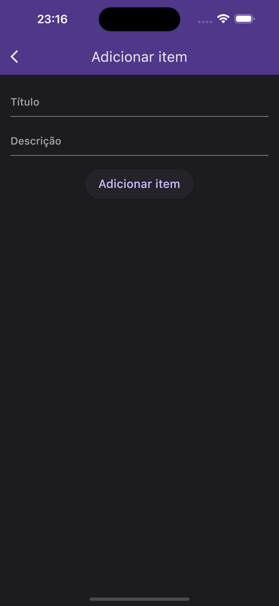

# dont_forget_market

This is my first project in Flutter.

His goal is to have an app to create a list of items to buy at the supermarket.

The project consists of three screens:

### No items on the list

### With items in the list

### The form for adding an item to the list

## Getting Started

1. Exucute the command on terminal: `flutter pub get` for download packages
2. Run project with `flutter run`
